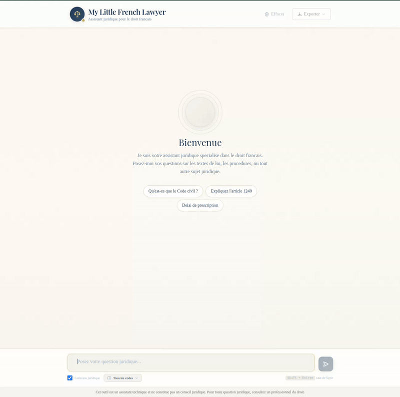

# My Little French Lawyer (MLFL)

A RAG (Retrieval Augmented Generation) pipeline for querying French legal documents.



## Architecture


## Pipeline Steps

### 1. Download Legal PDFs

Download law codes from Legifrance:
- https://www.legifrance.gouv.fr/liste/code?etatTexte=VIGUEUR&etatTexte=VIGUEUR_DIFF

Place PDF files in `01_extract_content/input/`.

### 2. Extract & Chunk

Extract text from PDFs and split into chunks for indexing.

```bash
python 01_extract_content/extract.py
```

### 3. Inject into Vector Database

Load chunks and inject into Qdrant using [BGE embeddings](https://huggingface.co/BAAI/bge-small-en-v1.5).

```bash
python 02_inject_rag/inject.py
```

Monitor injection progress in another terminal:

```bash
./02_inject_rag/watch_injection.sh
```


### 4. Query

Query the legal assistant with optional RAG support.

```bash
# Interactive chat with RAG
python 03_query/query.py --chat

# Interactive chat without RAG (vanilla mode)
python 03_query/query.py --chat --vanilla

# Single query
python 03_query/query.py "What is the penalty for theft?"

# Pipe input/output
echo "What is article 311-1?" | python 03_query/query.py

# Use Claude instead of Ollama
python 03_query/query.py --provider claude --chat

# Custom Ollama server
python 03_query/query.py --model llama3 --url http://localhost:11434
```

**Options:**

| Flag | Description |
|------|-------------|
| `-c, --chat` | Interactive chat mode |
| `-v, --vanilla` | Disable RAG (no vector store context) |
| `-p, --provider` | LLM provider: `ollama` (default) or `claude` |
| `-m, --model` | Model name override |
| `-u, --url` | Ollama server URL |
| `--qdrant-url` | Qdrant server URL |
| `--collection` | Qdrant collection name |

### 5. Evaluate

Compare RAG vs vanilla responses to measure RAG effectiveness.

```bash
# Run evaluation with default questions
python 04_evaluate/evaluate.py

# Use Claude for evaluation
python 04_evaluate/evaluate.py --provider claude

# Skip LLM analysis
python 04_evaluate/evaluate.py --no-analysis

# Custom output file
python 04_evaluate/evaluate.py --output my_results.md
```

Results are saved to `04_evaluate/results.md` with:
- Side-by-side comparison table
- Detailed responses for each question
- LLM-generated analysis of differences

### 6. Serve

A browser-based chat interface for non-technical users.


```bash
# Development mode
cd 05_serve/backend && pip install -r requirements.txt && python main.py
cd 05_serve/frontend && npm install && npm run dev
```

Access at `http://localhost:5173` (dev) or `http://localhost:8080` (production).

**Docker Deployment:**

```bash
# Full stack (GPU)
cd 05_serve && docker compose up --build

# CPU only
cd 05_serve && docker compose -f docker-compose.cpu.yml up --build

# Standalone (external Qdrant/Ollama)
docker run -p 8080:8080 \
  -e LLM_PROVIDER=ollama \
  -e OLLAMA_URL=http://your-ollama:11434 \
  -e QDRANT_URL=http://your-qdrant:6333 \
  mlfl-web:latest
```

**Environment Variables:**

| Variable | Default | Description |
|----------|---------|-------------|
| `LLM_PROVIDER` | `ollama` | `ollama` or `claude` |
| `OLLAMA_URL` | `http://localhost:11434` | Ollama server URL |
| `OLLAMA_MODEL` | `qwen3:4b` | Ollama model name |
| `ANTHROPIC_API_KEY` | - | Required if using Claude |
| `CLAUDE_MODEL` | `claude-sonnet-4-20250514` | Claude model name |
| `QDRANT_URL` | `http://localhost:6333` | Qdrant server URL |
| `QDRANT_COLLECTION` | `law_library` | Collection name |

**Features:**
- Chat interface with message history (session-only)
- RAG-powered responses with source citations
- Export conversations as Markdown or plain text
- Mobile responsive design

## Requirements

- Qdrant running on `localhost:6333`
```
docker run -p 6333:6333 -p 6334:6334 \
    -v "$(pwd)/qdrant_storage:/qdrant/storage:z" \
    qdrant/qdrant

```

- Ollama with a model installed (e.g., `smollm2:1.7b`)
